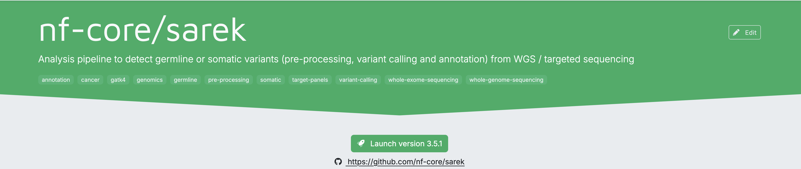
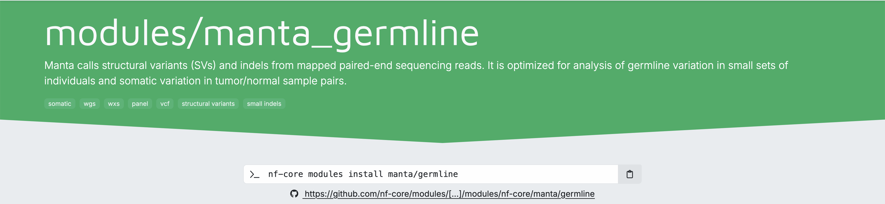
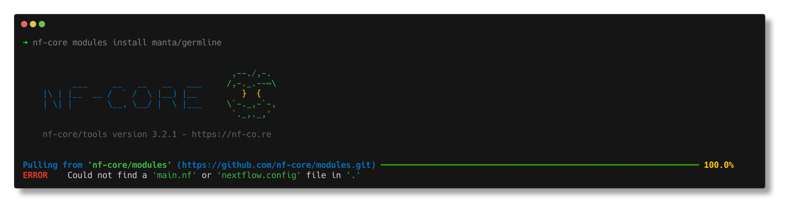
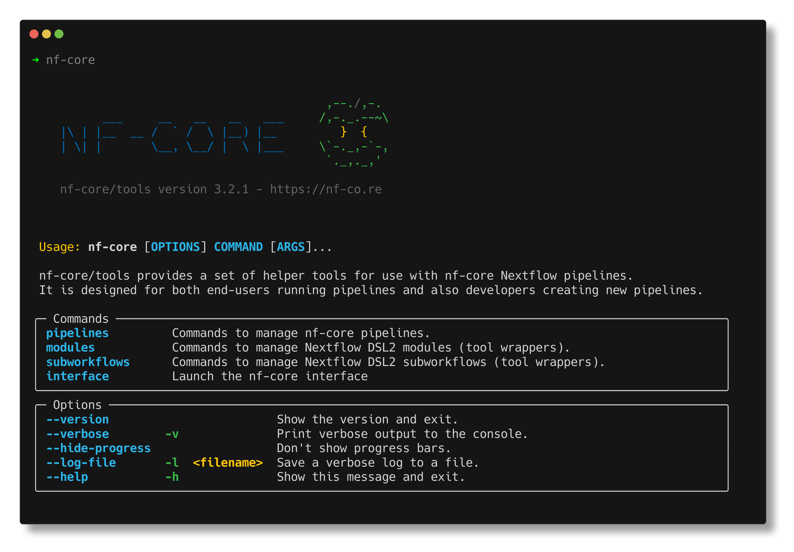
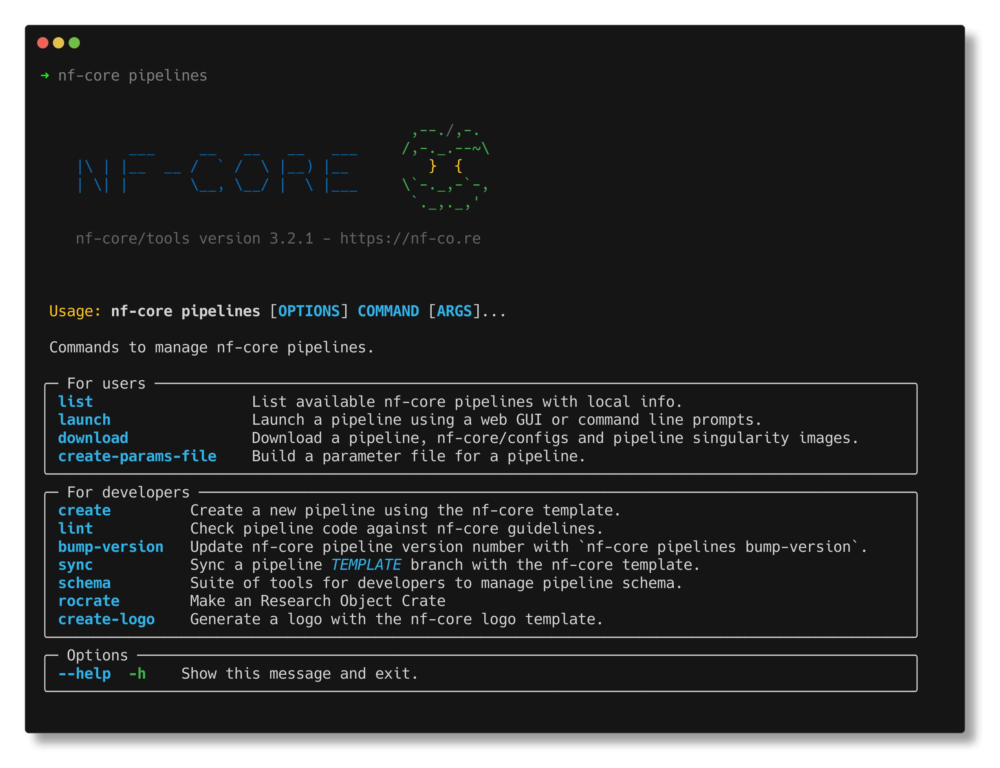
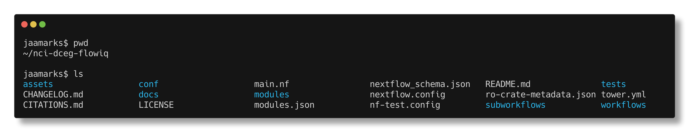
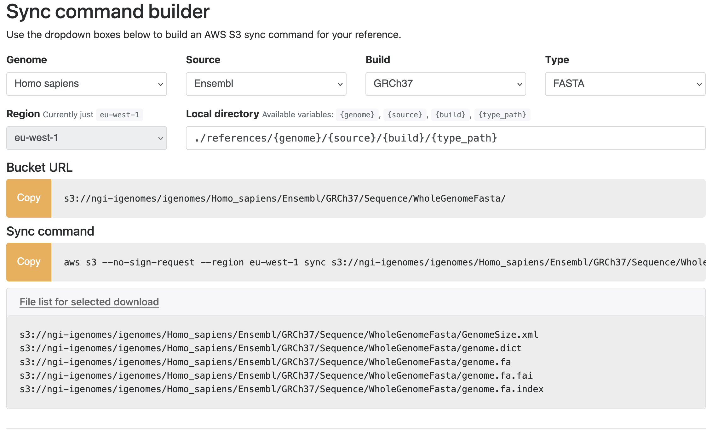
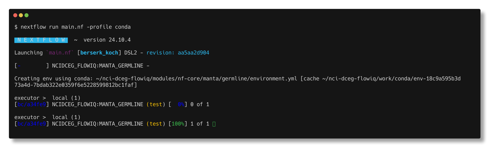
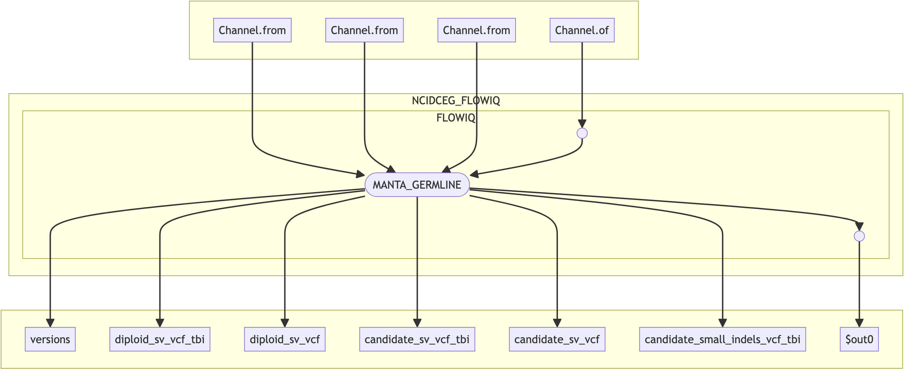

# Using Flow-IQ
Flow-IQ is a toolkit designed to help NIH researchers migrate and adapt their Nextflow-based pipelines—especially those relying on nf-core modules—from Biowulf HPC cluster to the AWS cloud.

This guide is organized into two main sections:
1. **Getting Started: Migrating to the Cloud** – How to use Flow-IQ to migrate an existing pipeline.
2. **Custom Pipeline Developement:** How to go from an nf-core module to a custom pipeline, run it on Biowulf, and then deploy it on AWS HealthOmics.


## Before You Start: What You Should Know
If you’re new to any of the core technologies used in Flow-IQ, here are some helpful resources:

   - **Nextflow:** [Nextflow](https://nextflow.io/docs/latest/index.html) A workflow system for creating scalable, portable, and reproducible workflows. Consider taking the Nextflow [training tutorial](https://training.nextflow.io/2.0/) to get up to speed.
   - **nf-core:** A community effort to collect a curated set of analysis pipelines built with Nextflow. Also see ["What is nf-core?"](https://nf-co.re/docs/usage/getting_started/introduction).
   - **Linters:** Tools that check code for errors or non-compliance with standards. Also see this [Wikipedia article](https://en.wikipedia.org/wiki/Lint_(software)) on linting.
   - **Containers:** Bundles your app and its dependencies so it runs the same everywhere. Also see the [Docker Container Guide](https://docs.docker.com/get-started/workshop/).
   
<br><br>


# 🚀 Getting Started: Migrating to the Cloud
   
Before migrating your pipeline to the cloud, check the following to ensure it meets basic cloud-readiness criteria:
- Uses **cloud-accessible paths** for input/output data (e.g., `s3://` instead of local or Biowulf file paths)
- Tools are executed within **containers** (e.g., Docker or Apptainer).
- Specifies **`cpus`** and **`memory`** for each process
- Use a **cloud-compatible executor** in your config (e.g., aws-batch)

<br>


## Adapt Your Pipeline For Cloud
Use the [FlowIQ website](https://nci-dceg.github.io/Flow-IQ/) to begin adapting your workflow for the cloud:

1. **Swap Biowulf Modules for Containers**<br> – Use the Docker Image Builder to find container equivalents for Biowulf environment modules and update your script accordingly.
1. **Update Data Paths**<br> – Use the Example Data Builder to locate cloud-hosted datasets (e.g., iGenomes on AWS).

## Validate your Workflow: Two-phase linting
Ensure your pipeline is cloud-ready and follows best practices using a two-phase linting approach.

### Phase 1 – Lightweight Cloud Linter
Use our [custom script](https://github.com/NCI-DCEG/Flow-IQ/tree/main/scripts) to run `linter-rules-for-nextflow` Docker container (converts to Apptainer).

This quick-check tool validates:
- Syntax (e.g., cpus, memory, container directives)
- Cloud readiness for [AWS HealthOmics](https://aws.amazon.com/healthomics/)
   
### Phase 2 – nf-core/tools Linter
For a more comprehensive check, run the [`nf-core/tools` lint](https://nf-co.re/docs/guidelines/pipelines/requirements/linting). This is especially usefule if you plan to **share, publish, or contribute** your pipeline. The nf-core community have put together amazing docs for [Getting Started with nf-core](https://nf-co.re/docs/usage/getting_started/introduction) that we encourage you to view.

<details>
  <summary>Expand for `nf-core/tools lint` details</summary>

<br>

**Why use nf-core/tools?**
The `nf-core` initiative promotes standardized, reproducible pipelines for the bioinformatics community. The linting tool checks your pipeline against [core requirements](https://nf-co.re/docs/guidelines/pipelines/overview) and highlights areas for improvement.

* Ensures your pipeline adheres to community best practices
* Verifies metadata, naming conventions, documentation, and structure
* Flags both required and [recommended](https://nf-co.re/docs/guidelines/pipelines/overview#recommendations) improvements

If your goal is collaboration or publication, using this tool is highly recommended.

</details>

---

<br><br>


# 🧱 Custom Pipeline Development
This section walks you through how to build a custom pipeline using an nf-core module, test it on the Biowulf HPC, and adapt it for AWS HealthOmics with Flow-IQ.

We'll follow a real-world example and explain each step, focusing on what needs to happen and why.


## Example Scenario

Suppose you’re working with the nf-core **[Sarek](https://nf-co.re/sarek/3.5.1/)** pipeline and then have an idea for an analysis using one step of the pipeline.
In particular, you want to build a custom pipeline for your analysis using the **[Manta germline](https://nf-co.re/modules/manta_germline/)** module. 

This guide will show you how to:
- Extract and reuse the module
- Build a minimal pipeline around it
- Test it locally (e.g., on Biowulf HPC)
- Prepare and deploy it to AWS HealthOmics using Flow-IQ

## Step 1: Locate the Module

Let’s say you’ve seen Manta used within the Sarek pipeline and want to use the manta_germline module in a standalone workflow.
You’re not modifying Sarek—you’re building something new, based on a reusable module.


<p float="left">
  
  
</p>


## Step 2: Understand How nf-core Modules Work

While it might seem like you can just run:
```bash
nf-core modules install manta/germline
```
...it's not quite that simple.
nf-core modules are reusable building blocks–not pipelines. You need a proper Nextflow pipeline project to plug the module into.
Without this, you'll run into errors because modules can't run on their own.
They need a pipeline "framework" to run within else you will get an error like you see below.

<p float="left">
  
</p>


So let's move on to the next step and see what we need to do first.

<br>

## Step 3: Create a pipeline

We’ll use the nf-core tool to scaffold a new custom pipeline.


<p float="left">
  
  
</p>

<br>

You’ll be walked through an interactive prompt to fill in:
- Basic info (name, description)
- Default template features (we’ll use the defaults)
- Location for the new pipeline
- Optional GitHub repo (you can skip this for now and add one later)


<p align="left">
   
</p>

<br>


## Step 4: Install the Manta Module

Inside your new pipeline folder, run:
```
nf-core modules install manta/germline
```

This will add the module to your project and update your `modules.json`.

<p align="left">
   
</p>


 > 💡 **Notice at the end of the GIF:** it shows how to include the module in your workflow using the following line:

```
include { MANTA_GERMLINE } from `../modules/nf-core/manta/germline/main`
```

Now let's build a simple pipeline using this Manta module.

<br>


<!--
<video width="300" height="200" src="https://github.com/user-attachments/assets/f3edf923-4df8-4345-8513-95dc07ba978c"></video>

<p float="left">
  
  
</p>

<table>
  <tr>
    <td></td>
    <td></td>
  </tr>
</table>
-->


## Step 5: Build a One-Step Workflow

When you first enter your newly created pipeline directory, you'll see a few files and directories generated by `nf-core`:

<p float="left"\>
  
</p>

For now, we'll focus on `main.nf`, which is the core Nextflow script where we'll integrate the `Manta` module into our custom pipeline.

-----

### Understanding `main.nf`

The first few lines of `main.nf` outline the pipeline's basic structure:

```groovy
/*
~~~~~~~~~~~~~~~~~~~~~~~~~~~~~~~~~~~~~~~~~~~~~~~~~~~~~~~~~~~~~~~~~~~~~~~~~~~~~~~~~~~~~~~~
    nci-dceg/flowiq
~~~~~~~~~~~~~~~~~~~~~~~~~~~~~~~~~~~~~~~~~~~~~~~~~~~~~~~~~~~~~~~~~~~~~~~~~~~~~~~~~~~~~~~~
    Github : https://github.com/nci-dceg/flowiq
----------------------------------------------------------------------------------------
*/

/*
~~~~~~~~~~~~~~~~~~~~~~~~~~~~~~~~~~~~~~~~~~~~~~~~~~~~~~~~~~~~~~~~~~~~~~~~~~~~~~~~~~~~~~~~
    IMPORT FUNCTIONS / MODULES / SUBWORKFLOWS / WORKFLOWS
~~~~~~~~~~~~~~~~~~~~~~~~~~~~~~~~~~~~~~~~~~~~~~~~~~~~~~~~~~~~~~~~~~~~~~~~~~~~~~~~~~~~~~~~
*/

include { FLOWIQ          } from './workflows/flowiq'
include { PIPELINE_INITIALISATION } from './subworkflows/local/utils_nfcore_flowiq_pipeline'
include { PIPELINE_COMPLETION     } from './subworkflows/local/utils_nfcore_flowiq_pipeline'
include { getGenomeAttribute      } from './subworkflows/local/utils_nfcore_flowiq_pipeline'
```

Locate the section labeled `IMPORT FUNCTIONS / MODULES / SUBWORKFLOWS / WORKFLOWS`. This is where you'll add the `include` statement for the `Manta` module you installed in Step 4. Add it directly below the existing `include` lines. This statement allows your pipeline to reference the module, which lives in the `modules/` directory at the root of your project.

-----

### Understanding `nextflow.config`

Now, let's look at the configuration file at the root of your pipeline: `nextflow.config`. This file is key for:

  * Setting pipeline-wide parameters.
  * Defining default values used throughout the workflow.
  * Referencing additional config files (like `conf/igenomes.config`).

For example, you might see this line in the `params` block:

`igenomes_base = 's3://ngi-igenomes/igenome'`

This line specifies the base path for AWS-hosted reference genome files. But how does your pipeline use it?

In `main.nf`, you might find a line like:

`params.fasta = getGenomeAttribute('fasta')`

This line leverages the `getGenomeAttribute` function, which was automatically included earlier. It dynamically builds the path to the correct reference file based on the genome build you've selected. For instance, if `params.genome = 'GRCh37'`, the FASTA file path would resolve to:

`s3://ngi-igenomes/igenomes/Homo_sapiens/Ensembl/GRCh37/Sequence/WholeGenomeFasta/genome.fa`

You can verify this logic by checking the contents of `conf/igenomes.config`, which supports various `igenomes` references:

<p float="left">
  
</p>

-----

### Understanding Manta's Requirements

To effectively use the `Manta` module, it's crucial to understand its expected inputs and outputs. The best place to find this information is the `nf-core` module page:

🔗 [https://nf-co.re/modules/manta\_germline/](https://nf-co.re/modules/manta_germline/)

On this page, you'll find:

  * A module description.
  * Detailed input/output channel definitions.
  * Parameter requirements.
  * A link to the module's source code on GitHub.

The corresponding GitHub repository is:

🔗 [https://github.com/nf-core/modules/tree/master/modules/nf-core/manta/germline](https://github.com/nf-core/modules/tree/master/modules/nf-core/manta/germline)

> 💡 **Tip:** Each `nf-core` module page also includes links to more in-depth documentation at the bottom.

All the information on the module's webpage is backed by its `meta.yml` file, located at `modules/nf-core/manta/germline/meta.yml`.

Let's dive into the input requirements for `Manta` as outlined on its webpage. You'll notice it specifies **four distinct input blocks**, some grouped under `meta`, `meta2`, and `meta3` variables, which bundle related values.

Here's a breakdown of each input block:

1.  **BAM/CRAM/SAM files + their indexes:**

      * These are the aligned sequencing reads (`.bam` or `.cram` files) that `Manta` will analyze.
      * Each input alignment file (e.g., `.bam`) **must** have a corresponding index file (`.bai` for BAM, `.crai` for CRAM).
      * For joint calling (analyzing multiple samples together), you can pass in multiple files.

2.  **Target regions (optional, for exome or targeted panels):**

      * A BED file, often compressed (`.bed.gz`), instructs `Manta` to limit variant calling to specific genomic regions (like exons).
      * It requires an accompanying `.tbi` index file for quick access.

3.  **Reference genome: FASTA file + index:**

      * The `fasta` file (grouped with `meta2`) is the reference genome. Your generated `main.nf` already has a section for managing this.
      * The `fai` file (grouped with `meta3`) is its corresponding FASTA index.

4.  **Optional config file:**

      * This allows you to customize `Manta`'s settings by providing your own configuration file.

-----

### ❓ What Do I Need to Run Manta?

To successfully run the `Manta` module, you'll need the following input files:

#### ✅ **Required**

  * One `.bam` or `.cram` file per sample, **paired with** its `.bai` or `.crai` index.
  * A reference genome in `.fa` format, **along with** its `.fa.fai` index.

#### 🟡 **Optional**

  * A BED file (`.bed.gz`) for targeted calling, plus its `.tbi` index.
  * A custom `Manta` configuration file.

-----

### Where to Find Example Input Files

The best place to start is by examining the `nf-core` module test file:<br>
`modules/nf-core/manta/germline/tests/main.nf.test`

Every `nf-core` module includes a `main.nf.test` file. This file defines how to test the module using small example datasets, typically sourced from the `nf-core/test-datasets` repository:

🔗 [https://github.com/nf-core/test-datasets](https://github.com/nf-core/test-datasets)

You can also find a detailed guide on using this data here:

🔗 [https://github.com/nf-core/test-datasets/blob/master/docs/USE\_EXISTING\_DATA.md](https://github.com/nf-core/test-datasets/blob/master/docs/USE_EXISTING_DATA.md)

-----

### About the Test Datasets

The `test-datasets` repository has a special `modules` branch specifically for individual module tests:

> This branch of the `nf-core/test-datasets` repository contains all data used for the individual module tests.

We'll use this branch to test our `Manta` module.

-----

### What `main.nf.test` Expects

If you open `main.nf.test`, you'll notice it references inputs like this:

```groovy
file(params.modules_testdata_base_path + 'genomics/homo_sapiens/illumina/cram/test.paired_end.sorted.cram', checkIfExists: true)
```

This indicates we need to define the base path `params.modules_testdata_base_path` in a configuration file.

-----

### ️Setting Up `manta_input_data_base_path`

Instead of modifying the main `nextflow.config`, it's generally cleaner to add this to a specific profile, such as the testing profile.

In `nextflow.config`, you'll find a `test` profile:

```groovy
test {
  includeConfig 'conf/test.config'
}
```

Edit the `conf/test.config` file and add the following:

```groovy
// Input data
// nf-core: Specify the paths to your test data from the test-datasets repo
modules_testdata_base_path = 'https://raw.githubusercontent.com/nf-core/test-datasets/modules/data/'
```

This approach leverages the GitHub raw URL, allowing Nextflow to directly access the files.

-----

### Running the Module Test

Once your configuration is set, you can run the test using the `nf-test` tool (a framework for testing Nextflow pipelines and modules):

```bash
nf-core modules test manta/germline -profile conda,test
```

<p float="left">
  
</p>

Now that we've seen how to test the `Manta` module using `nf-core` test data, we understand its required inputs, where to find example datasets, and how to configure them using Nextflow.

Let's apply that knowledge by modifying our `main.nf` script to build our own pipeline.

-----

### Integrating Manta into `main.nf`

From examining and running the `main.nf.test` script for `Manta`, we can see that for the simplest test case (`test("human - cram")`), there are four main input blocks. We'll model our `main.nf` after these.

First, let's look at the sample input block from the test:

```groovy
input[0] = [ [ id:'test'], // meta map
file(params.modules_testdata_base_path + 'genomics/homo_sapiens/illumina/cram/test.paired_end.sorted.cram', checkIfExists: true),

file(params.modules_testdata_base_path + 'genomics/homo_sapiens/illumina/cram/test.paired_end.sorted.cram.crai', checkIfExists: true),

[],[]
]
```

This represents a single sample CRAM file and its index, with no BED or BED index specified.

Next, we have the reference FASTA input sections:

```groovy
// fasta
input[1] = [ [id:'genome'],file(params.modules_testdata_base_path + 'genomics/homo_sapiens/genome/genome.fasta', checkIfExists: true)]

// fai
input[2] = [ [id:'genome'],file(params.modules_testdata_base_path + 'genomics/homo_sapiens/genome/genome.fasta.fai', checkIfExists: true)]
```

Followed by the config input:

```groovy
// config
input[3] = Channel.of("[manta]", "enableRemoteReadRetrievalForInsertionsInGermlineCallingModes = 0")
           .collectFile(name:"manta_options.ini", newLine:true)
```

We'll discuss how to best organize the workflow later, but for now, let's reuse these inputs in our pipeline and add them to the `main.nf` script at the root of your repository.

-----

### Defining Input Data Paths

The first section you'll notice in `main.nf` after the import statements is `GENOME PARAMETER VALUES`. Here, `nf-core` has pre-populated the line `params.fasta = getGenomeAttribute('fasta')`. The `Manta` module's second input block is for the FASTA and its corresponding index file.

While this `getGenomeAttribute` function is excellent for production runs with whole genome FASTA files from `igenomes` (see the dropdown below for details), for this tutorial, we'll stick with the simple example file used in the `Manta` test cases.

<details>
 <summary>Using Whole Genome FASTA File</summary>

The `getGenomeAttribute` function (`def getGenomeAttribute(attribute)`) is designed to fetch genome-specific attributes. As you can see from its definition (which you can find using `git grep getGenomeAttribute`):

```groovy
def getGenomeAttribute(attribute)
{
    if (params.genomes && params.genome && params.genomes.containsKey(params.genome))
    {
        if (params.genomes[ params.genome ].containsKey(attribute))
        {
            return params.genomes[ params.genome ][
              attribute ]
        }
    }
    return null
}
```

This function expects two parameters, `genomes` and `genome`, to be defined. In your `nextflow.config`, you'll already find a section for references:

```yaml
    // References
    genome                   = null
    igenomes_base            = 's3://ngi-igenomes/igenomes/'
```

This allows you to use `igenomes` references on AWS S3. To understand what to set for `genome`, you can consult `config/igenomes.config`, which lists various reference paths. For this example pipeline, we'll match the `Manta` test cases exactly.

</details>

When we ran our `Manta` module test, we added the following to `conf/test.config`:

```groovy
// Input data
// TODO nf-core: Specify the paths to your test data on nf-core/test-datasets
modules_testdata_base_path = 'https://raw.githubusercontent.com/nf-core/test-datasets/modules/data/'
```

Let's adapt this parameter for our main configuration file, `nextflow.config`, by renaming it and adding it to the `params` scope. Paste the following:

```groovy
    // Input options
    manta_input_data_base_path = 'https://raw.githubusercontent.com/nf-core/test-datasets/modules/data/'
```

-----

### Creating Input Channels in `main.nf`

Now, let's update our `main.nf` script by adding our inputs as **channels**. Nextflow is built on a dataflow programming model, where processes communicate through channels, which are fundamental for moving data through your pipeline. You can learn more about them here:

🔗 [https://www.nextflow.io/docs/latest/channel.html](https://www.nextflow.io/docs/latest/channel.html)

Add the following `CHANNEL DEFINITIONS` section to your `main.nf` script:

```groovy
/*
~~~~~~~~~~~~~~~~~~~~~~~~~~~~~~~~~~~~~~~~~~~~~~~~~~~~~~~~~~~~~~~~~~~~~~~~~~~~~~~~~~~~~~
    CHANNEL DEFINITIONS
~~~~~~~~~~~~~~~~~~~~~~~~~~~~~~~~~~~~~~~~~~~~~~~~~~~~~~~~~~~~~~~~~~~~~~~~~~~~~~~~~~~~~~
*/

// Channel for the first input: tuple val(meta), path(input), path(index), path(target_bed), path(target_bed_tbi)
Channel.from([
    tuple(
        [ id: 'test' ],                                                              // meta
        file(params.manta_input_data_base_path + 'genomics/homo_sapiens/illumina/cram/test.paired_end.sorted.cram', checkIfExists: true), // input (CRAM)
        file(params.manta_input_data_base_path + 'genomics/homo_sapiens/illumina/cram/test.paired_end.sorted.cram.crai', checkIfExists: true), // index (CRAI)
        [],                                                                          // target_bed (empty list, as no BED is used for this basic test)
        []                                                                           // target_bed_tbi (empty list)
    )
]).set { manta_main_input_ch } // This channel matches the first input signature

// Channel for the second input: tuple val(meta2), path(fasta)
Channel.from([
    tuple(
        [ id: 'genome' ],                                                          // meta2
        file(params.manta_input_data_base_path + 'genomics/homo_sapiens/genome/genome.fasta', checkIfExists: true) // fasta
    )
]).set { manta_fasta_ch }

// Channel for the third input: tuple val(meta3), path(fai)
Channel.from([
    tuple(
        [ id: 'genome' ],                                                          // meta3
        file(params.manta_input_data_base_path + 'genomics/homo_sapiens/genome/genome.fasta.fai', checkIfExists: true) // fai
    )
]).set { manta_fai_ch }

// Channel for the fourth input: path(config)
Channel
    .of("[manta]", "enableRemoteReadRetrievalForInsertionsInGermlineCallingModes = 0")
    .collectFile(name: "manta_options.ini", newLine: true)
    .set { manta_config_ch }
```

Essentially, we're taking the input syntax from the `tests/main.nf.test` script and wrapping these inputs in Nextflow channels.

-----

### Calling the Manta Module

With the input channels defined, we can now call our module within the main workflow:

```groovy
/*
~~~~~~~~~~~~~~~~~~~~~~~~~~~~~~~~~~~~~~~~~~~~~~~~~~~~~~~~~~~~~~~~~~~~~~~~~~~~~~~~~~~~~~~
    NAMED WORKFLOWS FOR PIPELINE
~~~~~~~~~~~~~~~~~~~~~~~~~~~~~~~~~~~~~~~~~~~~~~~~~~~~~~~~~~~~~~~~~~~~~~~~~~~~~~~~~~~~~~~
*/

workflow NCIDCEG_FLOWIQ {

    main:

    // Call MANTA_GERMLINE, feeding the channels in the correct order
    // as defined in the module's 'input:' block
    MANTA_GERMLINE(
        manta_main_input_ch, // Corresponds to `tuple val(meta), path(input), path(index), path(target_bed), path(target_bed_tbi)`
        manta_fasta_ch,      // Corresponds to `tuple val(meta2), path(fasta)`
        manta_fai_ch,        // Corresponds to `tuple val(meta3), path(fai)`
        manta_config_ch      // Corresponds to `path(config)`
    )
}

/*
~~~~~~~~~~~~~~~~~~~~~~~~~~~~~~~~~~~~~~~~~~~~~~~~~~~~~~~~~~~~~~~~~~~~~~~~~~~~~~~~~~~~~~~
    RUN MAIN WORKFLOW
~~~~~~~~~~~~~~~~~~~~~~~~~~~~~~~~~~~~~~~~~~~~~~~~~~~~~~~~~~~~~~~~~~~~~~~~~~~~~~~~~~~~~~~
*/

workflow {

    main:

    NCIDCEG_FLOWIQ()
}

/*
~~~~~~~~~~~~~~~~~~~~~~~~~~~~~~~~~~~~~~~~~~~~~~~~~~~~~~~~~~~~~~~~~~~~~~~~~~~~~~~~~~~~~~~
    THE END
~~~~~~~~~~~~~~~~~~~~~~~~~~~~~~~~~~~~~~~~~~~~~~~~~~~~~~~~~~~~~~~~~~~~~~~~~~~~~~~~~~~~~~~
*/
```

-----

### Running Your Pipeline

Now that your `main.nf` is updated, you can test the pipeline:

```bash
nextflow run main.nf -profile conda
```

<p float="left">
  
</p>

You've now created a minimal pipeline that successfully runs the `Manta` module\!

-----

### Finishing Touches: Organizing Your Pipeline

Now that we have a working pipeline, let's take a moment to clean things up and follow `nf-core` best practices.

Open your `main.nf` script. Near the top, you'll see a section like this:

```groovy
/********************************************************************************************************
    IMPORT FUNCTIONS / MODULES / SUBWORKFLOWS / WORKFLOWS
********************************************************************************************************/
include { FLOWIQ } from './workflows/flowiq'
```

This line tells us that the pipeline is importing a workflow definition from the `flowiq` script located in the `workflows/` directory.

👉 The `nf-core` convention is to keep the root `main.nf` minimal and delegate all workflow logic to these included scripts. This significantly improves readability, scalability, and maintainability as your pipeline grows.

Since we've added the `Manta` module to our pipeline, we should also relocate its `include` statement:

```groovy
include { MANTA_GERMLINE } from '../modules/nf-core/manta/germline'
```

This import should live in `workflows/flowiq.nf` instead of `main.nf`, because that's where the logic using it will reside.

In short: **keep `main.nf` tidy and focused** on high-level orchestration, and let `flowiq.nf` handle the details of your workflow.

Once you've done that, your pipeline will not only run correctly but also follow a clean, modular design that's easier to share and maintain.

-----

### Connecting Modules: Emitting Outputs

Finally, let's look at how to connect modules in a multi-step pipeline where you need to use the output from one module as input to another.

The `MANTA_GERMLINE` module produces several outputs, as defined in its `main.nf` script. To make these outputs available to other processes or for further use in your workflow, you need to `emit` them from your workflow.

Here's how you can do that within your `FLOWIQ` workflow:

```groovy
workflow FLOWIQ {

    main:

    MANTA_GERMLINE(
      manta_main_input_ch, // Corresponds to `tuple val(meta), path(input), path(index), path(target_bed), path(target_bed_tbi)`
      manta_fasta_ch,      // Corresponds to `tuple val(meta2), path(fasta)`
      manta_fai_ch,        // Corresponds to `tuple val(meta3), path(fai)`
      manta_config_ch      // Corresponds to `path(config)`
    )

    emit:
    candidate_small_indels_vcf     = MANTA_GERMLINE.out.candidate_small_indels_vcf
    candidate_small_indels_vcf_tbi = MANTA_GERMLINE.out.candidate_small_indels_vcf_tbi
    candidate_sv_vcf               = MANTA_GERMLINE.out.candidate_sv_vcf
    candidate_sv_vcf_tbi           = MANTA_GERMLINE.out.candidate_sv_vcf_tbi
    diploid_sv_vcf                 = MANTA_GERMLINE.out.diploid_sv_vcf
    diploid_sv_vcf_tbi             = MANTA_GERMLINE.out.diploid_sv_vcf_tbi
    versions                       = MANTA_GERMLINE.out.versions
}
```

We obtain the names of the output variables directly from the `output:` block of the `manta/germline/main.nf` script (e.g., `emit: candidate_small_indels_vcf`). These are then assigned to new variables within the `emit` block of our `FLOWIQ` workflow.

To verify that everything is working as expected, you can include a simple line in your workflow to print the contents of an output channel:

```groovy
candidate_small_indels_vcf.view()
```

You can also inspect the **Directed Acyclic Graph (DAG)** generated in the output directory specified by `params.outdir` in `nextflow.config`. It provides a visual overview of the data flow between processes. For example:

<p float="left">
   
</p>

This helps confirm the structure and behavior of your pipeline by showing how data moves through each channel.

**Note:** The `main.nf` and `workflows/flowiq.nf` scripts are included in this repository for your reference — in fact, we included the entire pipeline repository in `nci-dceg-flowiq`.


<br><br>
<br><br>
<br><br>
<br><br>


## Step 6: Test on Biowulf HPC

When running on Biowulf HPC, we need to configure settings specific to that environment—most importantly, specifying which **executor** to use.

This is typically done using **profiles** in the `nextflow.config` file. A profile allows you to bundle environment-specific settings like the executor type, memory and CPU allocations, and other resource or cluster-specific configurations. You can activate a profile using the `-profile` option when launching a pipeline.

On Biowulf, the key setting is:

```groovy
executor = 'slurm'
```

Let’s break down why this matters.

---

### ✅ What happens when `executor = 'slurm'` is set?

When you specify `executor = 'slurm'`, Nextflow:

* Submits jobs using `sbatch`
* Translates process directives (`cpus`, `memory`, `time`) into `#SBATCH` options
* Automatically manages cluster queue behavior (submission rate, polling interval, retries, etc.)
* Ensures each process runs on a compute node, not the local machine

This setup is essential for proper resource allocation and performance on clusters like Biowulf.

---

### ❌ What happens if `executor` is *not* set?

If you don’t specify an executor, Nextflow defaults to:

```groovy
executor = 'local'
```

Which means:

* All processes run on the same machine where `nextflow run` is executed
* No jobs are submitted to Slurm
* Resource directives like `--mem`, `--cpus`, and `--time` are not interpreted as SLURM constraints
* You’re simply multithreading on a single node—either in an interactive session or within an `sbatch`-wrapped shell

This is **not** what you want on an HPC cluster like Biowulf.

---

### How and where are resources set?

Just like the executor, resources like CPU, memory, and time are set through configuration files and Nextflow process labels.

For example, in `manta/germline/main.nf`:

```groovy
process MANTA_GERMLINE {
    tag "$meta.id"
    label 'process_medium'
    label 'error_retry'
}
```

The label `process_medium` refers to this block in `conf/base.config`:

```groovy
withLabel:process_medium {
    cpus   = { 6     * task.attempt }
    memory = { 36.GB * task.attempt }
    time   = { 8.h   * task.attempt }
}
```

This setup dynamically scales resources with retry attempts.

---

### Biowulf Support in nf-core/configs

Biowulf is one of the many clusters pre-configured in the [nf-core/configs](https://github.com/nf-core/configs) repository. This means you don’t have to define Biowulf-specific settings yourself.

You can simply run:

```bash
nextflow run main.nf -c nextflow.config -profile biowulf
```

Nextflow will automatically pull the Biowulf configuration from:

🔗 [https://github.com/nf-core/configs/blob/master/conf/biowulf.config](https://github.com/nf-core/configs/blob/master/conf/biowulf.config)

This profile sets `executor = 'slurm'`, defines staging behavior, handles file caching, and more—ready to use out of the box.

For more info, see:

🔗 [Biowulf-specific Nextflow docs at NIH](https://hpc.nih.gov/apps/nextflow.html)

🔗 [nf-core/configs homepage](https://nf-co.re/configs)

---

### ⚠️ Naming Conflicts When Adding Your Own Profiles

If you define your own `biowulf` profile in your local `nextflow.config`, it may **conflict** with the official one from `nf-core/configs`. That’s because Nextflow prioritizes remote profiles when you use `-profile`.

To avoid this, use a different name for custom configs:

```groovy
profiles {
  biowulf_custom {
    process.executor = 'slurm'
    // your overrides here
  }
}
```

Then launch with:

```bash
nextflow run main.nf -c nextflow.config -profile biowulf_custom
```

### How to Execute
Create a batch input file (e.g. `run_manta_on_biowulf.sh`) to run the master Nextflow process.
For example:
```bash
#! /bin/bash
#SBATCH --job-name=nextflow-main
#SBATCH --cpus-per-task=4
#SBATCH --mem=4G
#SBATCH --gres=lscratch:200
#SBATCH --time=24:00:00

module load nextflow
export NXF_SINGULARITY_CACHEDIR=/data/$USER/nxf_singularity_cache;
export SINGULARITY_CACHEDIR=/data/$USER/.singularity;
export TMPDIR=/lscratch/$SLURM_JOB_ID
export NXF_JVM_ARGS="-Xms2g -Xmx4g"

nextflow run main.nf -c nextflow.config -profile conda,biowulf
```

Submit the job using `sbatch`:
```
sbatch nf_main.sh
```

> **Note:** Find more details specific to using Nextflow on Biowulf HPC, see the official documentation at: https://hpc.nih.gov/apps/nextflow.html

<br>

A template submission script, `run_manta_on_biowulf.sh`, is also included in the `nci-dceg-flowiq` directory of this repo for your reference.

## Step 7: Prepare for AWS HealthOmics

Now that your pipeline works locally, it’s time to prepare it for the cloud:
- Use Flow-IQ tools to check for cloud-readiness
- Validate using the lightweight and nf-core/tools linters

<br>

## Step 8: Deploy to AWS HealthOmics

With validation complete, you’re ready to deploy:
- Upload your pipeline
- Set your input parameters and environment
- Launch your job on AWS HealthOmics


<br><br><br><br>

# ⚙️ Troubleshooting & Tips
## Seqera AI: Bioinformatics Agent for Nextflow
Seqera is the company behind Nextflow.
They have built an Bioinformatics AI agent trained specifically for Nextflow.
You can use this to accelerate your workflow building and reduce the time you spend troubleshooting so you can spend less time on the undifferentiated work and more time crafting your bioinformatics pipeline.

Here are the steps to using it:
1. Visit [**Ask-AI**](https://seqera.io/ask-ai/chat) by Seqera.
2. Sign in using your GitHub or Google account.

   > 💡 You can also try the [**Nextflow VS Code Extension**](https://marketplace.visualstudio.com/items?itemName=nextflow.nextflow) for inline AI support while coding.
3. Type a question or paste a prompt into the input bar to get help instantly.


<p float="left">
  
</p>
