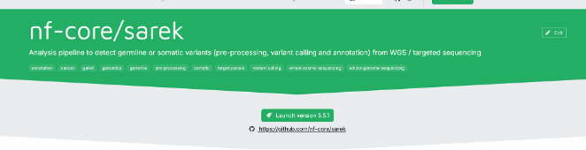
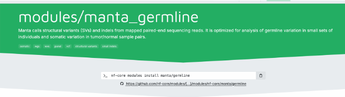
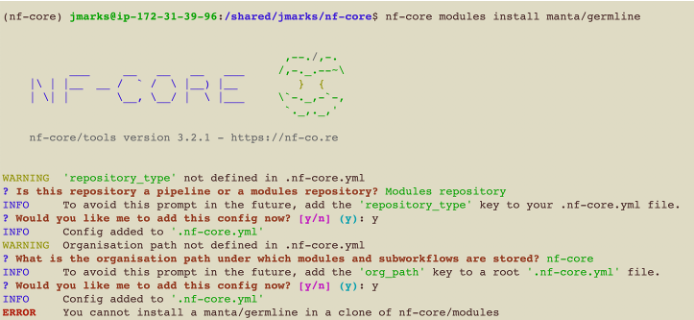
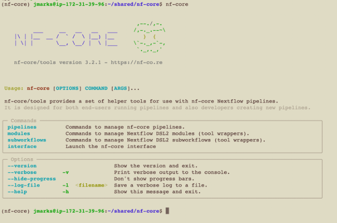
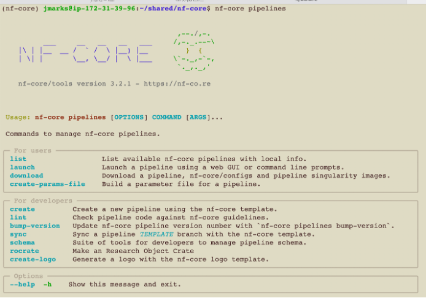
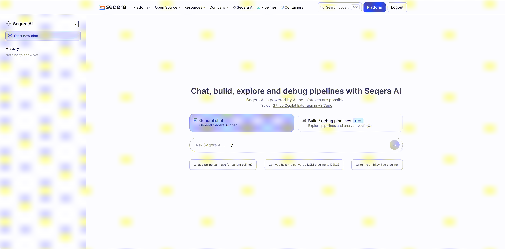

# Using Flow-IQ
Flow-IQ is a toolkit designed to help NIH researchers migrate and adapt their Nextflow-based pipelines—especially those relying on nf-core modules—from Biowulf HPC cluster to the AWS cloud.

This guide is organized into two main sections:
1. **Getting Started: Migrating to the Cloud** – How to use Flow-IQ to migrate an existing pipeline.
2. **Custom Pipeline Developement:** How to go from an nf-core module to a custom pipeline, run it on Biowulf, and then deploy it on AWS HealthOmics.


## Before You Start: What You Should Know
If you’re new to any of the core technologies used in Flow-IQ, here are some helpful resources:

   - **Nextflow:** [Nextflow](https://nextflow.io/docs/latest/index.html) A workflow system for creating scalable, portable, and reproducible workflows. Consider taking the Nextflow [training tutorial](https://training.nextflow.io/2.0/) to get up to speed.
   - **nf-core:** A community effort to collect a curated set of analysis pipelines built with Nextflow. Also see ["What is nf-core?"](https://nf-co.re/docs/usage/getting_started/introduction).
   - **Linters:** Tools that check code for errors or non-compliance with standards. Also see this [Wikipedia article](https://en.wikipedia.org/wiki/Lint_(software)) on linting.
   - **Containers:** Bundles your app and its dependencies so it runs the same everywhere. Also see the [Docker Container Guide](https://docs.docker.com/get-started/workshop/).
   
<br><br>


# 🚀 Getting Started: Migrating to the Cloud
   
Before migrating your pipeline to the cloud, check the following to ensure it meets basic cloud-readiness criteria:
- Uses **cloud-accessible paths** for input/output data (e.g., `s3://` instead of local or Biowulf file paths)
- Tools are executed within **containers** (e.g., Docker or Apptainer).
- Specifies **`cpus`** and **`memory`** for each process
- Use a **cloud-compatible executor** in your config (e.g., aws-batch)

<br>


## Adapt Your Pipeline For Cloud
Use the [FlowIQ website](https://nci-dceg.github.io/Flow-IQ/) to begin adapting your workflow for the cloud:

1. **Swap Biowulf Modules for Containers**<br> – Use the Docker Image Builder to find container equivalents for Biowulf environment modules and update your script accordingly.
1. **Update Data Paths**<br> – Use the Example Data Builder to locate cloud-hosted datasets (e.g., iGenomes on AWS).

## Validate your Workflow: Two-phase linting
Ensure your pipeline is cloud-ready and follows best practices using a two-phase linting approach.

### Phase 1 – Lightweight Cloud Linter
Use our [custom script](https://github.com/NCI-DCEG/Flow-IQ/tree/main/scripts) to run `linter-rules-for-nextflow` Docker container (converts to Apptainer).

This quick-check tool validates:
- Syntax (e.g., cpus, memory, container directives)
- Cloud readiness for [AWS HealthOmics](https://aws.amazon.com/healthomics/)
   
### Phase 2 – nf-core/tools Linter
For a more comprehensive check, run the [`nf-core/tools` lint](https://nf-co.re/docs/guidelines/pipelines/requirements/linting). This is especially usefule if you plan to **share, publish, or contribute** your pipeline. The nf-core community have put together amazing docs for [Getting Started with nf-core](https://nf-co.re/docs/usage/getting_started/introduction) that we encourage you to view.

<details>
  <summary>Expand for `nf-core/tools lint` details</summary>

<br>

**Why use nf-core/tools?**
The `nf-core` initiative promotes standardized, reproducible pipelines for the bioinformatics community. The linting tool checks your pipeline against [core requirements](https://nf-co.re/docs/guidelines/pipelines/overview) and highlights areas for improvement.

* Ensures your pipeline adheres to community best practices
* Verifies metadata, naming conventions, documentation, and structure
* Flags both required and [recommended](https://nf-co.re/docs/guidelines/pipelines/overview#recommendations) improvements

If your goal is collaboration or publication, using this tool is highly recommended.

</details>

---

<br><br>


# 🧱 Custom Pipeline Development
This section walks you through how to build a custom pipeline using an nf-core module, test it on the Biowulf HPC, and adapt it for AWS HealthOmics with Flow-IQ.

We'll follow a real-world example and explain each step, focusing on what needs to happen and why.


## Example Scenario

Suppose you’re working with the nf-core **[Sarek](https://nf-co.re/sarek/3.5.1/)** pipeline and then have an idea for an analysis using one step of the pipeline.
In particular, you want to build a custom pipeline for your analysis using the **[Manta germline](https://nf-co.re/modules/manta_germline/)** module. 

This guide will show you how to:
- Extract and reuse the module
- Build a minimal pipeline around it
- Test it locally (e.g., on Biowulf HPC)
- Prepare and deploy it to AWS HealthOmics using Flow-IQ

## Step 1: Locate the Module

Let’s say you’ve seen Manta used within the Sarek pipeline and want to use the manta_germline module in a standalone workflow.
You’re not modifying Sarek—you’re building something new, based on a reusable module.


<p float="left">
  
  
</p>


## Step 2: Understand How nf-core Modules Work

While it might seem like you can just run:
```bash
nf-core modules install manta/germline
```
...it's not quite that simple.
nf-core modules are reusable building blocks–not pipelines. You need a proper Nextflow pipeline project to plug the module into.
Without this, you'll run into errors because modules can't run on their own.
They need a pipeline "framework" to run within else you will get an error like you see below.

<p float="left">
  
</p>


So let's move on to the next step and see what we need to do first.

<br>

## Step 3: Create a pipeline

We’ll use the nf-core tool to scaffold a new custom pipeline.


<p float="left">
  
  
</p>

<br>

You’ll be walked through an interactive prompt to fill in:
- Basic info (name, description)
- Default template features (we’ll use the defaults)
- Location for the new pipeline
- Optional GitHub repo (you can skip this for now and add one later)


<p align="left">
   
</p>

<br>


## Step 4: Install the Manta Module

Inside your new pipeline folder, run:
```
nf-core modules install manta/germline
```

This will add the module to your project and update your `modules.json`.

<p align="left">
   
</p>


 > 💡 **Notice at the end of the GIF:** it shows how to include the module in your workflow using the following line:

```
INCLUDE { MANTA_GERMLINE } from ../modules/nf-core/manta/germline/main
```

Now let's build a simple pipeline using this Manta module.

<br>


<!--
<video width="300" height="200" src="https://github.com/user-attachments/assets/f3edf923-4df8-4345-8513-95dc07ba978c"></video>

<p float="left">
  
  
</p>

<table>
  <tr>
    <td></td>
    <td></td>
  </tr>
</table>
-->


## Step 5: Build a One-Step Workflow

Open the `main.nf` file in your pipeline.
This is the main entry point for your Nextflow script.
- Start with the basic structure from the template
- Add a simple process that uses the manta_germline module
- Modify any input/output paths and parameters to fit your test case

Now you’ve got a minimal pipeline that runs the module in isolation.

## Step 6: Test on Biowulf HPC

Run your new pipeline on Biowulf to ensure it works in your local environment.
This helps catch basic runtime issues before migrating to the cloud.


<br>

## Step 7: Prepare for AWS HealthOmics

Now that your pipeline works locally, it’s time to prepare it for the cloud:
- Use Flow-IQ tools to check for cloud-readiness
- Validate using the lightweight and nf-core/tools linters

<br>

## Step 8: Deploy to AWS HealthOmics

With validation complete, you’re ready to deploy:
- Upload your pipeline
- Set your input parameters and environment
- Launch your job on AWS HealthOmics


<br><br><br><br>

# ⚙️ Troubleshooting & Tips
## Seqera AI: Bioinformatics Agent for Nextflow
Seqera is the company behind Nextflow.
They have built an Bioinformatics AI agent trained specifically for Nextflow.
You can use this to accelerate your workflow building and reduce the time you spend troubleshooting so you can spend less time on the undifferentiated work and more time crafting your bioinformatics pipeline.

Here are the steps to using it:
1. Visit [**Ask-AI**](https://seqera.io/ask-ai/chat) by Seqera.
2. Sign in using your GitHub or Google account.

   > 💡 You can also try the [**Nextflow VS Code Extension**](https://marketplace.visualstudio.com/items?itemName=nextflow.nextflow) for inline AI support while coding.
3. Type a question or paste a prompt into the input bar to get help instantly.


<p float="left">
  
</p>