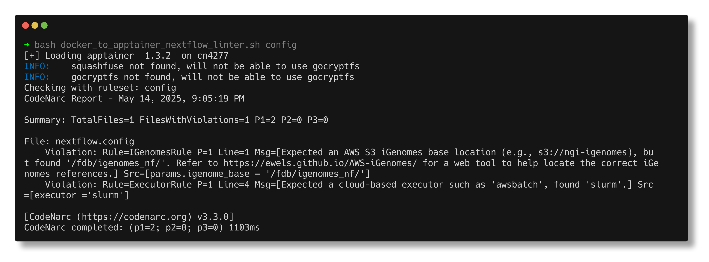

# docker_to_apptainer_nextflow_linter.sh

`docker_to_apptainer_nextflow_linter.sh` is a Bash script designed to convert the [`linter-rules-for-nextflow`](https://hub.docker.com/r/jaamarks/linter-rules-for-nextflow) Docker image into an Apptainer-compatible format. This allows you to run a lightweight Nextflow linter Docker image in a High-Performance Computing (HPC) environment that supports Apptainer but not Docker.

### Prerequisites

To use this tool, you need to have Apptainer installed in your environment. The conversion process requires a minor modification, which this script automates for you.

### Features

The script can be executed on a Nextflow script or a configuration file. It performs several checks, including:

- Verifying that directive names are correct (e.g., memory, path).
- Ensuring that CPU specifications are provided.
- Applying rules to make the configuration AWS cloud-ready for the HealthOmics service, such as providing an appropriate container URI and ensuring the correct technical specifications for specs ratio.

<br>

## Usage

1. Log in to an interactive compute node and load Apptainer:

   ```bash
   $ sinteractive
   ```

2. Execute the Bash script to load the Apptainer module, download the Docker image, convert the Docker image to a SIF image, and then execute the SIF:
   ```
   $ bash docker_to_apptainer_nextflow_linter.sh general      # Apply general Nextflow script checks
   $ bash docker_to_apptainer_nextflow_linter.sh healthomics   # Apply general checks and AWS HealthOmics specific checks
   $ bash docker_to_apptainer_nextflow-linter.sh config         # Apply linter to nextflow.config file
   ```

<p align="center"></p>

<br>


### Output Breakdown
<p align="center"></p>

Above is a static screenshot (captured using [`termshot`](https://github.com/homeport/termshot)) of the linter output. While the GIF in the usage section shows the tool in action, this freeze-frame gives us a chance to walk through the details of the output step by step.

The first line tells us which ruleset is being used — in this case, `config`, meaning we’re linting a Nextflow configuration file.

Next, we see a **Summary** section that reports:

* The total number of files checked
* How many of those files contained violations
* A breakdown by **priority level**:

  * **P1**: High priority
  * **P2**: Medium priority
  * **P3**: Low priority

Below that, we see the actual **violations**. Let’s break down the first one:

```
Violation: Rule=IGenomesRule P=1 Line=1 Msg=[Expected an AWS S3 iGenomes base location (e.g., s3://ngi-igenomes), but found '/fdb/igenomes_nf/'. Refer to https://ewels.github.io/AWS-iGenomes/ for a web tool to help locate the correct iGenomes references.] Src=[params.igenome_base = '/fdb/igenomes_nf/']
```

* **Rule**: `IGenomesRule` is the rule that was violated.
* **Priority (P)**: This is a P1 violation — highest priority.
* **Message**: The linter expected an AWS S3 iGenomes path but found a local path. It even provides a link to the AWS iGenomes reference tool.
* **Source**: It pinpoints the exact line and parameter (`params.igenome_base`) that triggered the warning.

Now let’s look at a second violation:

```
Violation: Rule=ExecutorRule P=1 Line=4 Msg=[Expected a cloud-based executor such as 'awsbatch', found 'slurm'.] Src=[executor ='slurm']
```

Here:

* **Rule**: `ExecutorRule` was violated.
* **Message**: The linter expected a cloud-native executor like `awsbatch`, but `slurm` was found instead.

📝 **Note:**
This tool performs a static analysis of the config file as a whole — it doesn’t know which profile will actually be used during execution. So if your config contains multiple profiles (e.g., `awsbatch` for cloud and `slurm` for local development), it may still flag the `slurm` entry as a violation. The linter errs on the side of caution, so be aware of possible false positives depending on your use case.

